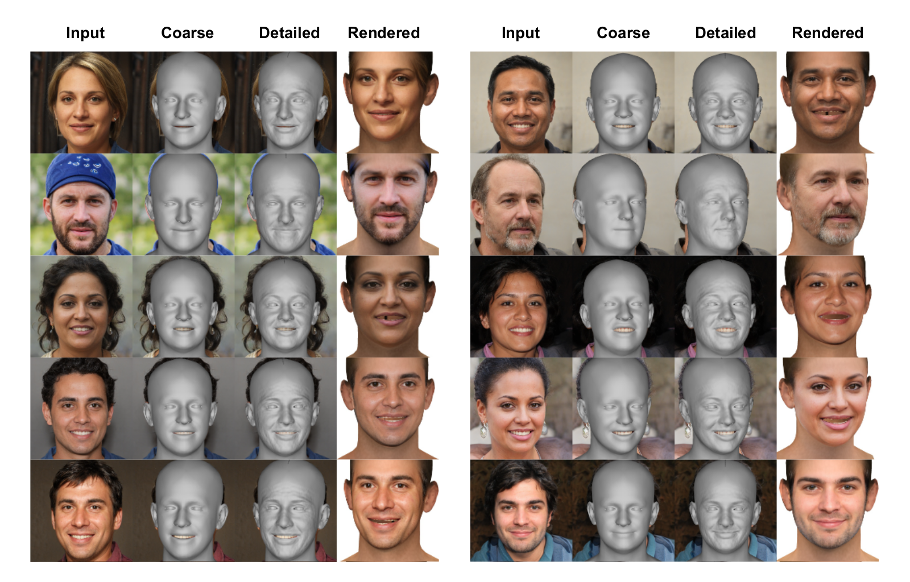

# Towards Realistic Generative 3D Face Models

Aashish Rai, Hiresh Gupta*, Ayush Pandey*,  Francisco Vicente Carrasco, Shingo Jason Takagi, Amaury Aubel, Daeil Kim, Aayush Prakash, Fernando de la Torre

### Carnegie Mellon University, Facebook/Meta

### WACV 2024 

[[Project Page](https://aashishrai3799.github.io/Towards-Realistic-Generative-3D-Face-Models)] [[Arxiv](https://arxiv.org/pdf/2304.12483.pdf)]

We propose a 3D face generative model that generates high-quality albedo and precise 3D shape by leveraging StyleGAN2, resulting in a photo-realistic rendered image.

## [Code Coming Soon! Stay Tuned...]

