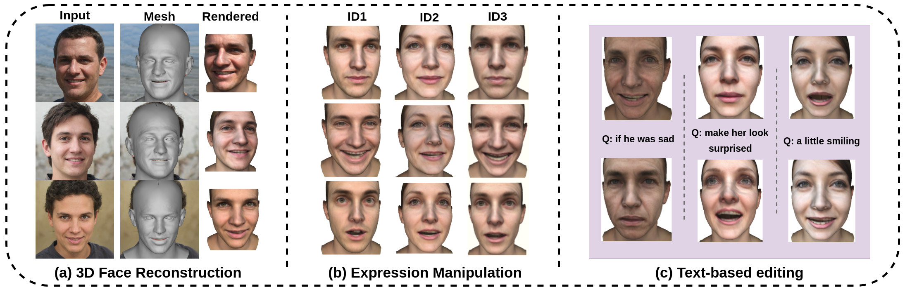

# Towards Realistic Generative 3D Face Models

Aashish Rai*, Hiresh Gupta*, Ayush Pandey*, Fernando de la Torre, Shingo Jason Takagi, Amaury Aubel, Daeil Kim, Aayush Prakash

### Carnegie Mellon University, Facebook/Meta

We propose a 3D face generative model that generates high-quality albedo and precise 3D shape by leveraging StyleGAN2, resulting in a photo-realistic rendered image.

## [More Details Coming Soon! Stay Tuned...]

